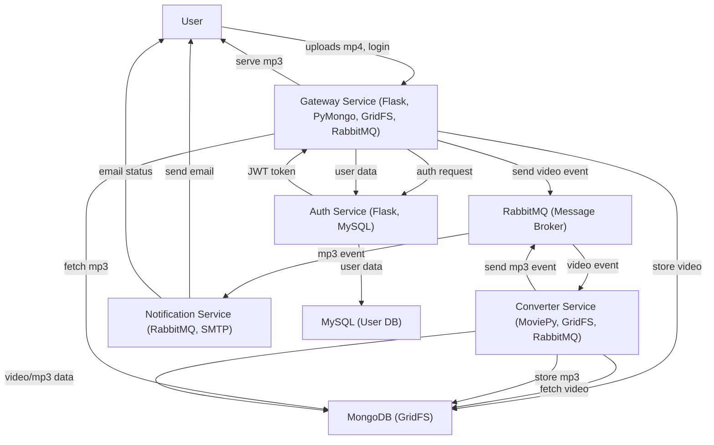

# MP4 to MP3 Microservice Backend

## Overview
This project is a production-level, microservices-based backend for converting MP4 video files to MP3 audio, with user authentication, notification, and scalable orchestration. It leverages modern cloud-native technologies for reliability, scalability, and maintainability.

---

## Technologies Used & Rationale

### 1. **Python**
- **Why:** Chosen for its rapid development, rich ecosystem, and strong support for web, data, and media processing.
- **Where:** All microservices are implemented in Python.

### 2. **Flask**
- **Why:** Lightweight, flexible web framework ideal for microservices and REST APIs.
- **Where:** Used in the Gateway and Auth services to expose HTTP endpoints.

### 3. **Docker**
- **Why:** Containerizes each service for consistent deployment, isolation, and scalability.
- **Where:** Every service has its own Dockerfile and runs as a container.

### 4. **Kubernetes (with Minikube)**
- **Why:** Orchestrates containers, manages scaling, rolling updates, and service discovery. Minikube is used for local development.
- **Where:** All services are deployed as Kubernetes Deployments, with ConfigMaps, Secrets, and Ingress for configuration and routing.

### 5. **k9s**
- **Why:** Terminal UI for managing and observing Kubernetes clusters, aiding in debugging and monitoring.
- **Where:** Used by developers/operators for cluster management.

### 6. **RabbitMQ**
- **Why:** Message broker enabling asynchronous, event-driven communication between services, ensuring decoupling and reliability.
- **Where:** Used for passing video and mp3 processing events between Gateway, Converter, and Notification services.

### 7. **MongoDB & GridFS**
- **Why:** MongoDB is a NoSQL database suitable for storing large files and metadata. GridFS allows efficient storage and retrieval of large video/audio files.
- **Where:** Used by Gateway and Converter services for storing and retrieving video and mp3 files.

### 8. **MySQL**
- **Why:** Relational database for structured user data and authentication.
- **Where:** Used by the Auth service for user credentials and authentication.

### 9. **Notification Service (Email/SMTP)**
- **Why:** Notifies users when their mp3 file is ready, improving user experience.
- **Where:** Notification service listens for mp3-ready events and sends emails via SMTP (Gmail).

### 10. **MoviePy**
- **Why:** Python library for video/audio processing, used for extracting audio from video files.
- **Where:** Used in the Converter service.

### 11. **Eventual Consistency**
- **Why:** Ensures the system remains available and scalable by processing tasks asynchronously. Users may not see immediate results, but the system guarantees eventual delivery and processing.
- **Where:** Achieved via RabbitMQ queues and asynchronous service design.

---

## Tech Stack
- **Languages:** Python 3.10
- **Frameworks:** Flask, Flask-MySQLdb, Flask-PyMongo
- **Databases:** MySQL, MongoDB (with GridFS)
- **Message Broker:** RabbitMQ
- **Media Processing:** MoviePy
- **Containerization:** Docker
- **Orchestration:** Kubernetes (Minikube)
- **Monitoring/Management:** k9s
- **Notification:** SMTP (Gmail)

---

## System Architecture & Workflow

### High-Level Workflow
1. **User uploads an MP4 video via the Gateway.**
2. **Gateway authenticates the user** via the Auth service (MySQL-backed).
3. **Gateway stores the video in MongoDB (GridFS)** and publishes a message to RabbitMQ.
4. **Converter service** consumes the message, fetches the video from MongoDB, converts it to MP3 using MoviePy, stores the MP3 in MongoDB, and publishes a new message to RabbitMQ.
5. **Notification service** consumes the mp3-ready message and sends an email to the user.
6. **User can download the MP3** via the Gateway once notified.

### Microservices
- **Gateway:** Handles uploads, downloads, authentication proxy, and event publishing.
- **Auth:** Manages user authentication and JWT issuance.
- **Converter:** Converts MP4 to MP3, handles file storage and event publishing.
- **Notification:** Sends email notifications to users.
- **RabbitMQ:** Message broker for all asynchronous events.
- **MongoDB/GridFS:** Stores video and audio files.
- **MySQL:** Stores user credentials.

### System Design Diagram

---

## Deployment & Operations
- **Docker Compose / Kubernetes manifests** are provided for local and production deployment.
- **Minikube** is recommended for local Kubernetes testing.
- **k9s** can be used for cluster monitoring and troubleshooting.

---

## Eventual Consistency
- The system is designed for high availability and scalability.
- All heavy processing (conversion, notification) is asynchronous.
- Users are notified when their files are ready, not before.
- Failures in conversion or notification do not block the main workflow and can be retried.

---

## Security
- **JWT-based authentication** for secure access.
- **Secrets and ConfigMaps** for managing sensitive data and configuration in Kubernetes.

---

## Contributing
Pull requests and issues are welcome. Please follow best practices for Python, Docker, and Kubernetes.

---

## License
MIT License 